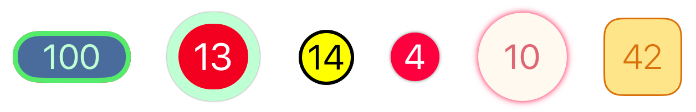
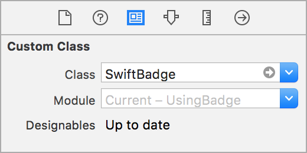
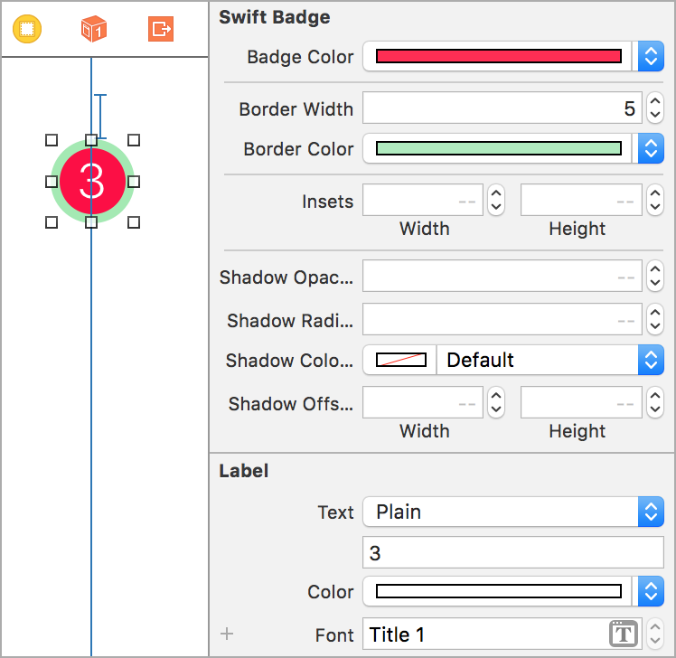
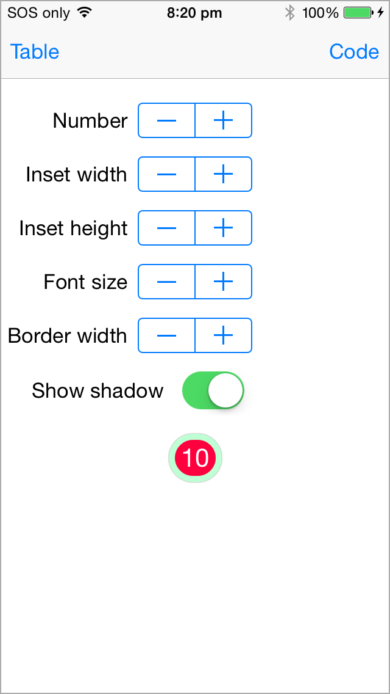
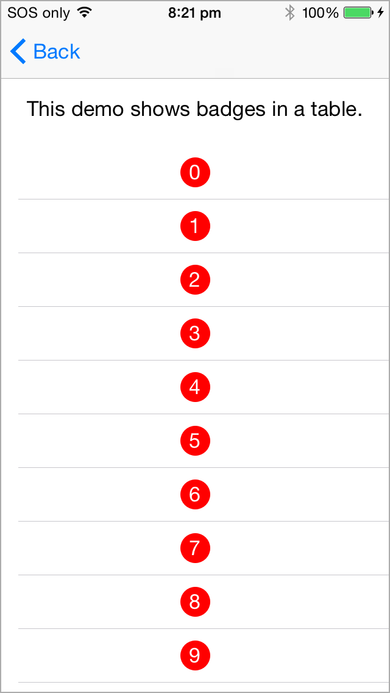
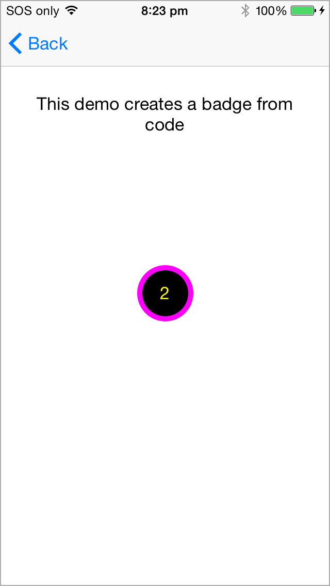

# A badge control for iOS written in Swift

* The badge is a subclass of UILabel view.
* It can be created and customized from the Storyboard or programatically.

## Usage

Copy [BadgeSwift.swift](https://github.com/marketplacer/swift-badge/blob/master/BadgeSwift/BadgeSwift.swift) to your project.


### Creating a badge in Storyboard

* Drag a **Label** to your view.
* Set its `class` to `BadgeSwift` in identity inspector.



* Set the badge properties in the attributes inspector.




### Creating a badge from code

```Swift
let badge = BadgeSwift()
view.addSubview(badge)
// Position the badge ...
```

[See example](https://github.com/marketplacer/swift-badge/blob/master/Demo-iOS/ViewControllers/CreateBadgeFromCodeViewController.swift) of how to create and position the badge from code in the demo app.

#### Customization

```Swift
// Text
badge.text = "2"

// Insets
badge.insets = CGSize(width: 12, height: 12)

// Font
badge.font = UIFont.preferredFontForTextStyle(UIFontTextStyleBody)

// Text color
badge.textColor = UIColor.yellowColor()

// Badge color
badge.badgeColor = UIColor.blackColor()

// Shadow
badge.shadowOpacityBadge = 0.5
badge.shadowOffsetBadge = CGSize(width: 0, height: 0)
badge.shadowRadiusBadge = 1.0
badge.shadowColorBadge = UIColor.blackColor()

// No shadow
badge.shadowOpacityBadge = 0

// Border width and color
badge.borderWidth = 5.0
badge.borderColor = UIColor.magentaColor()
```

## Demo app

This project includes a demo app.





## Alternative solutions

Here are some alternative badges for iOS.

* [ckteebe/CustomBadge](https://github.com/ckteebe/CustomBadge)
* [JaviSoto/JSBadgeView](https://github.com/JaviSoto/JSBadgeView)
* [mikeMTOL/UIBarButtonItem-Badge](https://github.com/mikeMTOL/UIBarButtonItem-Badge)
* [mustafaibrahim989/MIBadgeButton-Swift](https://github.com/mustafaibrahim989/MIBadgeButton-Swift)
* [soffes/SAMBadgeView](https://github.com/soffes/SAMBadgeView)
* [tmdvs/TDBadgedCell](https://github.com/tmdvs/TDBadgedCell)

## Contributors

* Thanks to [amg1976](https://github.com/amg1976) for adding a border and redesigning the drawing.

## License

SwiftBadge is released under the [MIT License](LICENSE).

## Feedback is welcome

If you found a bug or want to improve the badge feel free to create an issue.
